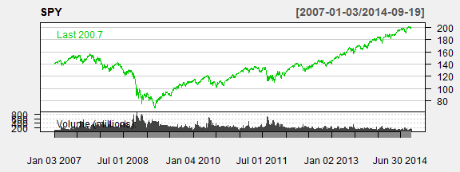
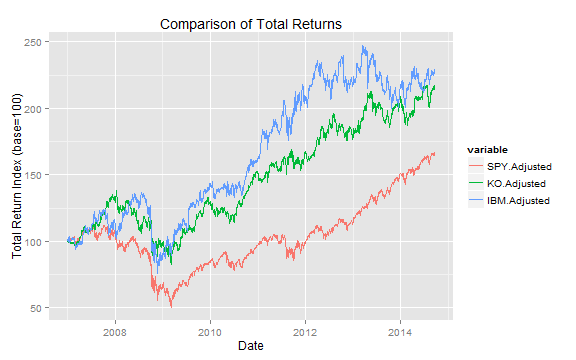

StockChartPresentation
========================================================
author: Bech4Jens
date: 21/09/2014

What is "StockChart"?
========================================================

- A simple app that downloads and charts stock prices from Yahoo Finance via the "quantmod" package

- It allows you quickly to compare the historical returns of up to three different stocks

- With StockChart you can quickly customize the chart-type according to your preferences

- StockChart also allows full customization of the time period

Single Stock Chart
========================================================
- To get started, Let's choose the ticker "SPY" - an ETF that tracks the price and yield performance of the S&P 500 Index

```r
library('quantmod')
getSymbols("SPY", src = "yahoo")
```

```
[1] "SPY"
```

 

Comparison of Absolute Returns
========================================================
- Another usefull feature is to compare the absolute returns of different stocks
- Let's see how "SPY" has done against coca-cola "KO" and "IBM"


 

Why the World Needs StockChart
========================================================
- Webpages like Yahoo Finance typically have complex and unintuitive layouts filled with hundreds of features, but most people only use very few features

- Most webpages only allow comparison of stock prices, but not absolute returns including dividends

- The World needs the StockChart app as a quick reference for stock prices and absolute returns!

- Get started with StockChart on [http://bech4jens.shinyapps.io/StockChart](http://bech4jens.shinyapps.io/StockChart)
- ...or download the code from GitHub [https://github.com/Bech4Jens/StockChart](https://github.com/Bech4Jens/StockChart)
